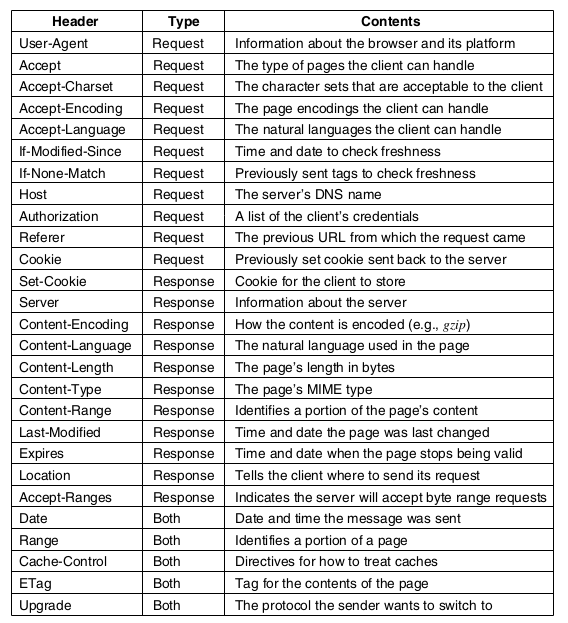

# Protocolo HTTP

O protocolo HTTP encontra-se na camada de aplicação dos modelos TCP/IP e OSI.

<fig>Modelo OSI. (Fonte: freeCodeCamp [1]) </fig>

## Arquitetura Cliente-Servidor

### Cliente

- Dispositivo ou aplicativo que solicita serviços ou recursos.
- Geralmente um navegador web, mas pode ser qualquer aplicativo que faça requisições a servidores.

### Servidor

- Dispositivo ou programa que fornece serviços ou recursos em resposta às solicitações do cliente.
- Pode hospedar sites, aplicativos, ou dados.

### Comunicação

<fig>Arquitetura da web. (Fonte: Tanenbaum [3])</fig>

#### Requisição (Request)

- O cliente envia uma requisição ao servidor para obter informações ou realizar uma ação.
- Utiliza o protocolo HTTP para estruturar e enviar a requisição.

#### Resposta (Response)

- O servidor processa a requisição e envia uma resposta de volta ao cliente.
- A resposta contém os dados solicitados ou informações sobre a execução da ação.

<fig>Arquitetura Cliente-Servidor. (Fonte: MDN [2])</fig>

## O Protocolo HTTP

- Desenvolvido por Tim Berners-Lee entre 1989 e 1991, no CERN (Organização Europeia para a Pesquisa Nuclear), o HTTP é o protocolo subjacente à World Wide Web.
- Concluído até o final de 1990, marcando o início oficial da World Wide Web em agosto de 1991.
- Define as regras para a comunicação entre cliente e servidor na web.
- Permite a transferência de documentos hipertexto, como páginas web.

- Requisições e respostas HTTP têm um formato específico com cabeçalhos e, opcionalmente, um corpo com dados.

<fig>Alguns cabeçalhos HTTP. (Fonte: Tanenbaum [3])</fig>

- Cada requisição é independente das anteriores, sem armazenamento de estado entre transações (_stateless_).
- Define diferentes métodos, como `GET` para obter dados, `POST` para enviar dados ao servidor, etc.

<fig>Métodos HTTP. (Fonte: Tanenbaum [3])</fig>

- A versão do HTTP, o código de status e a frase de motivo acompanham as respostas na linha de status.
- Códigos de status (números de 3 dígitos) acompanhados de frases de motivo resumem o significado do código.

<fig>Códigos de status. (Fonte: Tanenbaum [3])</fig>

- Descrições fornecidas na primeira linha da resposta, conhecida como linha de status.

## Versões do Protocolo HTTP

- Versões comumente usadas: HTTP/1.0 (RFC 1945) e HTTP/1.1 (RFC 2616).
- Clientes e servidores podem usar versões diferentes, e a versão é indicada na primeira linha de requisições e respostas.

## Referências

- [1] [FreeCodeCamp](https://www.freecodecamp.org/news/an-introduction-to-http-understanding-the-open-systems-interconnection-model-9dd06233d30e/)
- [2] [MDN - Client-Server](https://developer.mozilla.org/en-US/docs/Learn/Server-side/First_steps/Client-Server_overview)
- [3] Computer networks / Andrew S. Tanenbaum, David J. Wetherall. 5th ed.
- [4] [MDN - HTTP](https://developer.mozilla.org/en-US/docs/Web/HTTP/Basics_of_HTTP/Evolution_of_HTTP)
- [5] [Baeldung](https://www.baeldung.com/cs/http-versions)
- [6] [W3C](https://www.w3.org/Protocols/History.html)
- [7] [IBM](https://www.ibm.com/docs/en/cics-ts/5.3?topic=concepts-http-protocol)
- [8] [TCP/IP Guide](http://www.tcpipguide.com/free/t_HTTPOverviewHistoryVersionsandStandards.htm)
