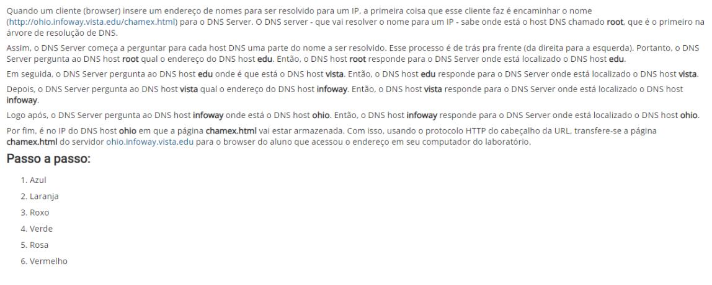

<head><meta charset="utf-8"/></head>

### Questão 1

Com base no código a seguir, analise as questões apresentadas e marque a alternativa CORRETA:

I) Para que os dois clientes possam acessar o servidor simultaneamente, será necessário que o servidor instancie dois processos filhos para atender essas conexões. Do contrário, um dos clientes ficará aguardando até que o outro termine o diálogo iniciado.

II) Para viabilizar código full-duplex nesse código entre o servidor e dois ou mais clientes, uma das modificações possíveis no código do servidor, seria o uso da system call select() necessariamente associado a um mecanismo de instanciação do processo servidor (com uso de fork ou criação de threads filha) para atender cada um dos clientes que solicitou a conexão.

III) Se alterássemos o código do cliente retirando tanto o preenchimento da **struct cliAddr** o código apresentado continuaria funcionando

a. Apenas a afirmação II é correta
b. Apenas as afirmações II e III são corretas
c. Apenas a afirmação III está correta
d. Todas afirmações estão corretas
e. Apenas a afirmação I é correta

### Questão 2

Em questão de minutos, uma onda gigantesca de acessos tirou do ar o Yahoo!. O método usado no ataque pode ser entendido por meio de uma analogia. É como se você desse tanto trabalho para uma pessoa fazer que ela pararia tudo o que estivesse fazendo para ficar apenas 'anotando os seus pedidos, sem prestar atenção a mais ninguém'.

De acordo com o texto acima, é correto afirmar que o site do Yahoo! sofreu uma ataque que afetou o seu serviço de:

Escolha uma opção:

a. Confidencialidade;
b. Disponibilidade;
c. Integridade;
d. Controle de Acesso.
e. Autenticidade;

### Questão 3

Analise as questões e marque a alternativa CORRETA:

a. Se a máquina X não contivesse sistema operacional, poderia requisitá-lo de um servidor presente na Internet por meio do protocolo ARP
b. Na configuração do desenho, um pacote IP com TTL=3 saindo de X não conseguirá alcançar a máquina Z.
c. Nenhuma das alternativas apresentada é correta
e. Na configuração do desenho, basta um único servidor DHCP para atender a rede toda (supor que não existe relay de DHCP - repassador de mensagens DHCP entre roteadores).

Comentários:
O serviço DHCP é baseado em endereços MAC e, por isso, o serviço não é roteável naturalmente. Por outro lado, se o serviço DHCP estiver no roteador R, ele só consegue atribuir endereços (de redes distintas) para as redes locais (i) e (ii) e o mesmo ocorre com o roteador S, visualizando apenas as redes (ii) e (iii). Portanto, na configuração apresentada seriam necessários pelo menos dois servidores DHCP para atender os três segmentos de rede local. Se Z for configurado com um IP válido e não-privado, não será preciso utilizar NAT. Além disso, mesmo que Z tenha IP privado, o NAT pode ser instalado no host  S.

### Questão 4

Folha de São Paulo - 14/02/2008 - 11h33
Petrobras confirma furto de informações sigilosas

"A Petrobras confirmou nesta quinta-feira que dados sobre pesquisas sísmicas, que podem incluir a descoberta de petróleo e gás, foram furtados de um contêiner da empresa. Segundo a estatal, as informações eram sigilosas e relevantes. A Petrobras informou apenas que o furto foi feito de uma empresa terceirizada prestadora de serviços, mas não citou nomes. Segundo fontes ouvidas pela Folha Online, o contêiner era transportado pela norte-americana Halliburton.

Segundo a Petrobras, o furto ocorreu no início deste mês e a investigação está sob sigilo. Uma missão especial da Polícia Federal no Rio, em conexão direta com o comando da PF em Brasília, estaria no caso.

Na ocasião do crime, o contêiner da Halliburton se dirigia a Macaé (RJ), rumo à base de operações da estatal na Bacia de Campos, transportando equipamentos, quando ocorreu o furto dos dados, que estariam em um disco rígido e computadores portáteis.

A estatal não informou detalhes sobre o conteúdo dos dados roubados, nem se continham números sobre o megacampo de Tupi, na Bacia de Santos. A Petrobras também evitou comentar detalhes do furto, mas disse que possui cópias das informações."

De acordo com o texto acima, marque a opção correta.

Escolha uma opção:

a. Pelo texto acima, fica claro que os computadores portáteis da Petrobrás permitem o acesso de pessoas não autorizadas.
b. De acordo com o exposto, pode-se concluir que o transporte dos equipamentos da Petrobrás não apresenta vulnerabilidades.
c. A integridade dos dados das pesquisas feitas pela Petrobrás foi atingida neste roubo.
d. O roubo das informações caracterizou um ataque ao serviço de disponibilidade da Petrobrás.
e. Uma forma da Petrobrás garantir a confidencialidade dos dados, seria a utilização de mecanismos de criptografia.

### Questão 5

Considere a configuração de rede a seguir, considerando a quantidade de equipamentos assinalada na figura para cada segmento de rede:

Assumindo um endereço de rede classe C que deve ser utilizado para endereçar todos os hosts dessa rede, analise os itens apresentados a seguir e marque a resposta correta:

a. Nenhuma das alternativas apresentadas é correta
c. A fim de minimizar o desperdício de endereços, é possível utilizar uma faixa de endereços sequencial para as interfaces de rede dos equipamentos R, S e W
d. A máscara de sub-rede 255.255.255.224 aplicada ao segmento de rede #1 será suficiente para mapear todos os endereços dessa rede
e. Considerando desperdício mínimo de endereços em cada sub-rede, a máscara adequada para a rede #2 desperdiçará mais endereços do que a rede #3

Comentários: Nesse segmento há 32 hosts e a máscara 255.255.255.224 consegue mapear apenas 30 endereços para os hosts. Nesse caso, uma máscara 255.255.255.192 resolveria.

### Questão 6

Analise as afirmativas abaixo e, em seguida, marque a alternativa correta.

I) Pacotes IP possuem área de dados e de payload variável, podendo o conjunto todo chegar até o limite de 16K.

II) Numa rede IP, se um host A enviar um pacote IP para um host B, esse pacote terá o campo de CheckSum recalculado por cada roteador intermediário por onde o pacote passar, mesmo que a área de dados do pacote não tenha sido alterada ao longo do caminho.

III) Um determinado host que possua uma interface de rede configurada com endereço 127.0.0.1 pode ser acessado (por telnet ou pacotes ICMP) por um outro host (computador remoto), com IP 127.0.0.2. Isso ocorre assumindo que a tabela de rotas está correta e ambos estão utilizando o mesmo endereço Classe A.

a. Apenas a alternativa II) está correta

b. As alternativas I) e II) estão corretas

c. As alternativas II) e III) estão corretas

d. As alternativas I) e III) estão corretas

e. Apenas a alternativa III) está correta

Comentários:

(i) Falso. Pacotes IP possuem área de dados e de payload variável, mas o conjunto todo pode chegar a 64K, uma vez que o campo Total Lenght do cabeçalho tem 16 bits (2ˆ16 =64K)
(ii) Verdadeiro. Numa rede IP, os pacotes tem o seu cabeçalho alterado por rotinas de controle. Por exemplo, o campo TTL (Time to Live) é decrementado a cada salto que o pacote sofre e essa alteração exige que o campo Header CheckSum seja recalculado a cada roteador intermediário.
(iii) Falso. Em redes IP, a faixa 127.0.0.0 é um endereço Classe A alocado para loopback, ou seja, os IPs dessa faixa são utilizados apenas para conexões IP internas ao host e não para comunicação entre hosts.

### Questão 7

Analise as afirmações abaixo e, a seguir, marque a alternativa correta

I) O bit URG é suficiente para garantir o envio de dados urgentes entre entidades TCP

II) No TCP/IP, a API-Socket pode ser considerada uma forma de facilitar o acesso às funcionalidades dos protocolos da camada de transporte (TCP e UDP)

III) O segmento TCP tem cabeçalho de tamanho variável e payload de tamanho fixo

a. Apenas III) é falsa

b. Apenas II) e III) são falsas

c. Apenas II) é falsa

d. Apenas I) e III) são falsas

e. Apenas I) é falsa

Comentários:
(i) Falso. O bit URG precisa ser utilizado em conjunto com o campo Urgent Pointer do cabeçalho TCP para garantir a correta identificação da posição onde começam os dados urgentes a serem interpretados pelo destinatário.
(ii) Verdadeiro
(iii) Falso. Os campos IHL e Total length informam os tamanhos do cabeçalho e do segmento TCP, dando a entender que tanto o cabeçalho quanto o payload são de tamanho variável.

### Questão 8

Sobre criptografia, marque a alternativa correta:

Escolha uma opção:

a. Decriptação é a codificação dos dados, gerando um criptograma.
b. Existem regras de projeto claras para facilitar a vida dos projetistas de algoritmos de criptografia.
c. Na esteganografia troca-se a posição dos caracteres na mensagem.
d. Para melhor segurança, é importante que a lógica do algoritmo não seja divulgada.
e. Criptoanálise é o estudo de meios para "quebrar" um algoritmo de criptografia ou criptograma.

### Questão 9 (Aberta)

Explique como funcionam os protocolos IMAP, POP e SMTP para o serviço de e-mails. Na explicação, descrever a relação entre esses protocolos, caso exista

### Questão 10

Sobre a camada de transporte, analise as afirmações abaixo e escolha a alternativa CORRETA.

I) A desconexão UDP é assimétrica, ou seja, ocorre de modo que basta apenas um dos lados se desconectar, para que a desconexão seja garantida

II) No UDP, uma solução para envio rápido de dados entre as partes comunicantes com uso de algoritmos como a Solução de Clark e o Algoritmo de Nagle

III) Um dos problemas da camada de transporte é que ela não consegue associar várias conexões de transporte numa única conexão de rede e nem fazer uma única conexão de transporte em várias conexões de rede.

a. Apenas I e III estão incorretas
b. Apenas II e III estão corretas
c. Apenas a alternativas III  está correta
d. Todas estão incorretas e. Apenas I e II estão corretas

### Questão 11

Sobre a camada de transporte, analise as afirmações abaixo e escolha a alternativa CORRETA.

I) O TCP usa a medida de RTT (Round Trip Time) para computar os timeouts de uma conexão. Esse mecanismo ocorre, porque o tempo de espera de reconhecimentos é variável ao longo de uma conexão

II) O TCP possui mecanismos para reserva de buffers no lado receptor da conexão, a fim de viabilizar o envio de segmentos da janela deslizante

III) No TCP, o envio de um único byte de dados (1 caractere) implica num overhead de 40 bytes de cabeçalho, considerando os cabeçalhos TCP e IP.

a. Todas estão corretas
b. Apenas I e II estão corretas
c. Apenas II e III estão corretas
d. Apenas I está correta
e. Apenas I e III estão corretas

### Questão 12

Considere a seguinte topologia, cujos equipamentos são atualizados por algoritmos de roteamento dinâmico:

Suponha que tais equipamentos estejam configurados com o protocolo  RIP (distance vector) e que, num determinado momento, os seguintes vetores chegaram ao roteador C:

Com base nessas informações, responda a alternativa correta em relação à nova tabela de rotas do equipamento C (contendo os novos atrasos em relação aos roteadores):

a. Para chegar em F, o caminho a ser percorrido é CEF
b. O atraso de C em relação a B é menor que o atraso de C em relação a F
c. A diferença dos atrasos de C em relação à A e B é igual a 3
d. A soma dos atrasos dos vizinhos em relação a D é superior a 20
e. Nenhuma das alternativas apresentadas é correta

Comentários: O caminho correto é CDF. A soma dos atrasos dos vizinhos é igual a 30 (8+6; 5+0; 7+4)

### Questão 13

De acordo com as características do algoritmo DES, analise as afirmações abaixo e assinale a opção correta.

I) As tabelas de permutação (P-boxes) são utilizadas para se fazer transposições entre os bits de um bloco, onde algumas delas são voltadas para expansão e outras utilizadas para se fazer contração.

II) Apesar da chave ser 64 bits, apenas 56 deles são utilizados e ela não sofre mudanças durante todo o processo de encriptação.

III) Em cada uma das 16 rodadas do algoritmo, a chave sofre uma adição de 1 ou 2 bits, dependendo da rodada.

Escolha uma opção:

a. Somente I e III são verdadeiras.
b. Todas as afirmações são verdadeiras.
c. Todas as afirmações são falsas.
d. Somente II é verdadeira.
e. Somente II e III são falsas.

### Questão 14

Podemos dizer que a integridade está comprometida na seguinte situação:

Escolha uma opção:

a. Desativação de um sistema de arquivos.
b. Análise de tráfego de uma rede por meio de um sniffer;
c. Interrupção de uma rede por causa de uma inundação de tráfego que degradou seu desempenho;
d. Captura e acesso a um arquivo transferido via rede entre um cliente e um servidor;
e. Alteração de partes de uma mensagem legítima; Obter o aplicativo para dispositivos móveis

### Questão 4

Considere um grupo de N pessoas que se comunicam entre si usando Criptografia simétrica. Todas as comunicações entre quaisquer duas pessoas do grupo também são visíveis para as demais. Nenhuma outra pessoa fora deste grupo pode decriptar as mensagens trocadas. Com base nisto, analise as afirmações abaixo e marque a alternativa correta.

I) O sistema como um todo requer o uso de apenas duas chaves.
II) Se a Criptografia utilizada fosse assimétrica, seriam necessários N pares de chaves (pública e privada).
III) Neste sistema não há problema com a distribuição das chaves, já que as pessoas são conhecidas.

Escolha uma opção:

a. Somente I e II são falsas.
b. Todas as afirmações são verdadeiras.
c. Somente II e III são falsas.
d. Todas as afirmações são falsas.
e. Somente I e III são falsas.

### Questão 8

Marcação de caractere, uso de tinta invisível, perfurações, fita corretiva de máquina de escrever, entre outras técnicas caracterizam:

Escolha uma opção:

a. Confidencialidade.
b. Integridade.
c. Esteganografia.
d. Criptoanálise.
e. Criptografia.

### Questão 11

Analise as afirmações abaixo e marque a alternativa correta.

I) O formato MIME Types é utilizado tanto em mensagens SMTP quanto WWW e permite especicar tipos de dados mais arrojados, diferente do que ocorre com o RFC822 (apenas texto).
II) Serviços HTTP podem ser configurados para atenderem na porta 90 e podem ser acessados diretamente por um cliente não Web (telnet, por exemplo)
III) Os serviços da camada de aplicação são baseados no modelo Peer-to-peer, ao contrário da camada de transporte, que é baseada no modelo cliente-servidor

a. Apenas I) e II) estão corretas

b. Apenas II) está correta

c. Apenas I) e III) estão corretas

d. Apenas II) e III) estão corretas

e. Apenas I) está correta

Comentários:
(i) e (ii) Correto
(iii) Serviços da camada de aplicação do modelo TCP/IP são baseados nos modelos P2P e Cliente/servidor. Por outro lado, as instâncias da camada de transporte são entidades pares, na qual nenhuma delas assume o papel de cliente ou servidor

### Questão 15 (Aberta)

Analise a configuração de rede a seguir, distribua os endereços e mostre as tabelas de rota dos equipamentos X, Y, R e W, de modo que haja conectividade (a nível de camada IP entre todos esses equipamentos e também com a Internet). Considerar ainda, que as conexões de R com os roteadores X, Y e Z, devem ser resolvidas com desperdício mínimo de endereços, da faixa 192.168.100.0 (usar máscara de sub- rede nesses enlaces).

Na resposta, apresentar a tabela abaixo preenchida com endereços de rede, máscara e broadcast, além das rotas de todos os
equipamentos das redes identificadas, de tal forma que essas máquinas consigam visualizar todas as demais (do ponto de vista da
camada IP) e consigam acessar a Internet. Nesse caso supor que o IP de R para Internet (linha net da tabela) é 200.0.0.1.
A resposta deve ser feita nos moldes da tabela a seguir:

### Questão 2 (Aberta)

Um aluno entra no computador do laboratório e digita o seguinte endereço no browser: <http://ohio.infoway.vista.edu/chamex.html>. Explique como o servidor DNS do laboratório consegue descobrir o endereço IP da máquina que contém o arquivo chamex.html. Na resposta, apontar os hosts DNS envolvidos e explicar passo a passo como ocorre a resolução de endereços nesse caso.

### Gabarito

Questão 15 (Aberta)

Questão 2 (Aberta)

- 1 = Apenas a afirmação III está correta
- 2 = Disponibilidade;
- 3 = Nenhuma das alternativas apresentada é correta.
- 4 = Uma forma da Petrobrás garantir a confidencialidade dos dados, seria a utilização de mecanismos
- 5 = Considerando desperdício mínimo de endereços em cada sub-rede, a máscara adequada para a rede #2 desperdiçará mais endereços do que a rede #3.
- 6 = Apenas a alternativa (ii) está correta
- 7 = Apenas (i) e (iii) são falsas
- 8 = Criptoanálise é o estudo de meios para "quebrar" um algoritmo de criptografia ou criptograma.
- 10 = Todas estão incorretas
- 11 =  Todas estão corretas
- 12 =  A soma dos atrasos dos vizinhos em relação a D é superior a 20
- 13 =  Somente II e III são falsas.
- 14 =  Alteração de partes de uma mensagem legítima; Obter o aplicativo para dispositivos móveis
- 4 = Somente I e III são falsas.
- 8 = Esteganografia.
- 11 = Apenas (i) e (ii) estão corretas E Apenas (i) e (iii) estão corretas

