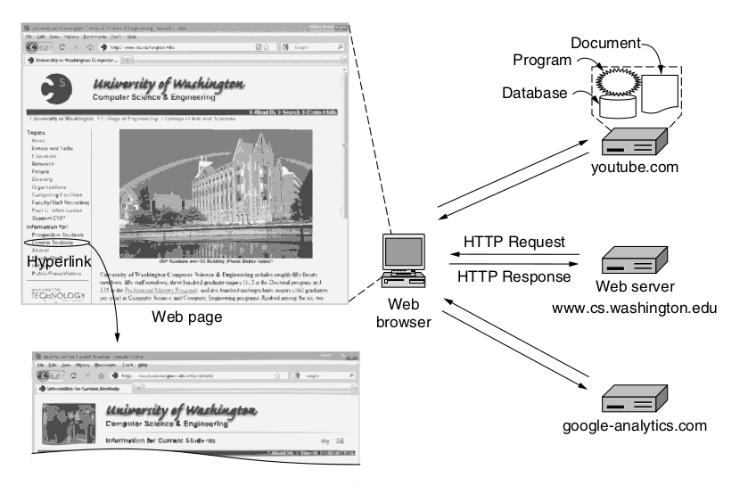
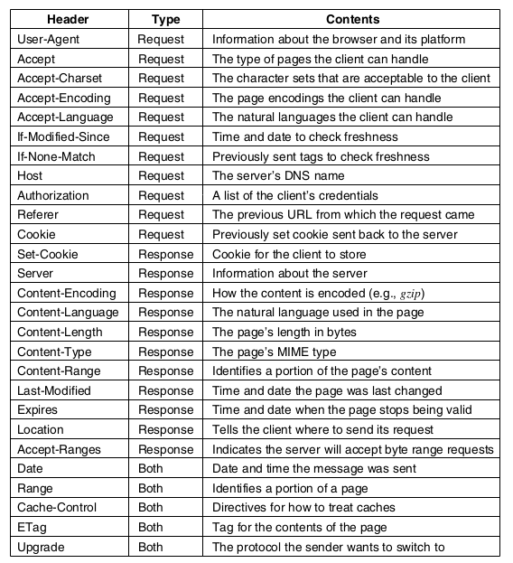
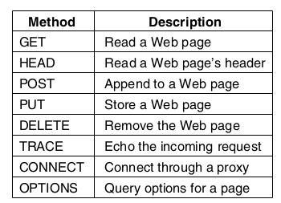

# Protocolo HTTP

| Identificação | -                                |
| ----------- | ------------------------------------ |
| Aluno       | Nicolas Chagas Souza                 |
| Matrícula   | 200042327                            |
| Disciplina  | Fundamentos de Redes de Computadores |
| Turma       | 01                                   |

## Referencial Teórico

O protocolo HTTP encontra-se na camada de aplicação dos modelos TCP/IP e OSI.


<fig>Modelo OSI. (Fonte: freeCodeCamp [1]) </fig>

### Arquitetura Cliente-Servidor

#### Cliente

- Dispositivo ou aplicativo que solicita serviços ou recursos.
- Geralmente um navegador web, mas pode ser qualquer aplicativo que faça requisições a servidores.

#### Servidor

- Dispositivo ou programa que fornece serviços ou recursos em resposta às solicitações do cliente.
- Pode hospedar sites, aplicativos, ou dados.

#### Comunicação


<fig>Arquitetura da web. (Fonte: Tanenbaum [3])</fig>

##### Requisição (Request)

- O cliente envia uma requisição ao servidor para obter informações ou realizar uma ação.
- Utiliza o protocolo HTTP para estruturar e enviar a requisição.

##### Resposta (Response)

- O servidor processa a requisição e envia uma resposta de volta ao cliente.
- A resposta contém os dados solicitados ou informações sobre a execução da ação.


<fig>Arquitetura Cliente-Servidor. (Fonte: MDN [2])</fig>

### O Protocolo HTTP

- Desenvolvido por Tim Berners-Lee entre 1989 e 1991, no CERN (Organização Europeia para a Pesquisa Nuclear), o HTTP é o protocolo subjacente à World Wide Web.
- Concluído até o final de 1990, marcando o início oficial da World Wide Web em agosto de 1991.
- Define as regras para a comunicação entre cliente e servidor na web.
- Permite a transferência de documentos hipertexto, como páginas web.

- Requisições e respostas HTTP têm um formato específico com cabeçalhos e, opcionalmente, um corpo com dados.


<fig>Alguns cabeçalhos HTTP. (Fonte: Tanenbaum [3])</fig>

- Cada requisição é independente das anteriores, sem armazenamento de estado entre transações (_stateless_).
- Define diferentes métodos, como `GET` para obter dados, `POST` para enviar dados ao servidor, etc.


<fig>Métodos HTTP. (Fonte: Tanenbaum [3])</fig>

- A versão do HTTP, o código de status e a frase de motivo acompanham as respostas na linha de status.
- Códigos de status (números de 3 dígitos) acompanhados de frases de motivo resumem o significado do código.


<fig>Códigos de status. (Fonte: Tanenbaum [3])</fig>

- Descrições fornecidas na primeira linha da resposta, conhecida como linha de status.

### Versões do Protocolo HTTP

A primeira versão do HTTP (0.9) permitia apenas que fossem recebidas informações de um servidor apenas com a operação `GET`, e a troca de informações era permitida apenas no formato ASCII.

#### HTTP/1.1

A versão 1.1 do protocolo foi lançada em 1997, e adicionou à versão anterior (1.0) diversas extensões, dentre as quais destacam-se, conforme apontado em [Baeldung [5]](#referências):

- Cabeçalho Host:
  - No HTTP 1.0, não era oficialmente exigido, mas no HTTP 1.1, sua inclusão é requerida pela especificação.
  - Importante para rotear mensagens por servidores proxy, permitindo distinguir domínios que compartilham o mesmo IP.
- Conexões Persistentes:
  - No HTTP 1.0, cada par de requisição/resposta requer a abertura de uma nova conexão.
  - No HTTP 1.1, é possível executar várias requisições usando uma única conexão.
- Status de Continue:
  - Introduzido para evitar que servidores recusem requisições inviáveis.
  - Os clientes podem enviar apenas os cabeçalhos da requisição primeiro e verificar se recebem um código de status de Continue (100).
- Novos Métodos:
  - Além dos métodos já disponíveis no HTTP 1.0, a versão 1.1 adicionou seis métodos extras: PUT, PATCH, DELETE, CONNECT, TRACE e OPTIONS.
- Outras Melhorias Introduzidas na Versão 1.1 do HTTP:
  - Compressão e Descompressão.
  - Suporte a Vários Idiomas.
  - Transferências de Intervalo de Bytes.

#### HTTP/2

A versão 2 do protocolo foi lançada em 2015, e teve como principal foco a melhora no desempenho do protocolo, principalmente por torná-lo um protocolo binário, no qual os dados trafegam na forma binária para diminuir o overhead. As principais alterações, conforme apontado em [Baeldung [5]](#referências), foram:

- **Multiplexação de Requisições:**
  - O HTTP 1.1 é um protocolo sequencial, permitindo enviar apenas uma requisição por vez, já no HTTP 2.0, é possível enviar requisições e receber respostas de forma assíncrona, permitindo várias requisições simultâneas usando uma única conexão.

- **Priorização de Requisições:**
  - No HTTP 2.0, é possível atribuir uma priorização numérica a um conjunto de requisições, o que permite explicitar a ordem desejada para as respostas, como obter o CSS de uma página da web antes de seus arquivos JS.

- **Compressão Automática:**
  - Ao contrário do HTTP 1.1, onde a compressão de requisições e respostas deve ser explicitamente solicitada, o HTTP 2.0 realiza automaticamente a compressão com GZip.

- **Reset de Conexão:**
  - Permite fechar uma conexão entre servidor e cliente por algum motivo, abrindo imediatamente uma nova.

- **Server Push:**
  - Introduz uma funcionalidade para evitar que o servidor receba muitas requisições, de forma que o servidor tenta prever os recursos que serão solicitados em breve e proativamente envia esses recursos para o cache do cliente.

#### HTTP/3

Ao contrário das versões anteriores, que eram documentos do IETF (_Internet Engineering Task Force_) conhecidos como RFC (_Request For Comments_), o HTTP 3.0 é um _Internet-Draft_. O primeiro rascunho foi publicado em 2020. As inovações fornecidas nessa última alteração visam aumentar a segurança por meio de criptografia, como o fato de o HTTP 3.0 sempre criar conexões criptografadas, o que se assemelha à prática de sempre usar HTTPS na atual versão HTTP 2.0.

O principal diferencial entre HTTP 2.0 e HTTP 3.0 reside no protocolo de transporte utilizado, o HTTP 2.0 emprega conexões TCP, com ou sem TLS (para HTTPS e HTTP) enquanto o HTTP 3.0, por sua vez, é projetado sobre o protocolo QUIC (Quick UDP Internet Connections) -  um protocolo de camada de transporte com multiplexação nativa e criptografia integrada, ele oferece um processo de handshake rápido e é capaz de mitigar problemas de latência em conexões com perda de pacotes e baixa velocidade. A utilização do QUIC traz benefícios potenciais, como uma rápida negociação de conexão e eficiência na mitigação de latência em conexões problemáticas.

## Prática

O experimento será realizado com dois containers docker, sendo uma imagem de nginx usada para o lado servidor e uma de linux (debian) para o lado cliente.

### Configuração do Ambiente

#### Orquestração dos serviços

```yaml title="docker-compose.yml" linenums="1"
--8<--
trabalho2/files/docker-compose.yml
--8<--
```

#### Configurações do servidor (Nginx)

```Dockerfile title="nginx.Dockerfile" linenums="1"
--8<--
trabalho2/files/nginx.Dockerfile
--8<--
```

```text title="nginx.conf" linenums="1"
--8<--
trabalho2/files/nginx.conf
--8<--
```

#### Configurações do cliente (debian)

```Dockerfile title="debian.Dockerfile" linenums="1"
--8<--
trabalho2/files/debian.Dockerfile
--8<--
```

O seguinte script será executado no início do container, para realizar as conexões ao servidor utilizando as versões especificadas do protocolo HTTP.

```shell title="get_http" linenums="1"
--8<--
trabalho2/files/get_http
--8<--
```

### Execução

Para executar o experimento, basta executar o comando a seguir na pasta onde encontram-se os arquivos de configuração:

```shell
# A flag -d indica que os containers rodaram em modo detached do terminal.
docker compose up -d 
```

Para verificar os resultados do experimento, verifique os logs do container do cliente, rodando o comando:

```shell
docker logs debian 
```

### Resultados

#### HTTP/1.1

```text
Testando HTTP/1.1 com o comando curl (curl --include --http1.1 -X GET http://nginx):
Resultado:
HTTP/1.1 200 OK
Server: nginx/1.25.3
Date: Mon, 20 Nov 2023 15:50:37 GMT
Content-Type: text/plain
Content-Length: 56
Connection: keep-alive

Hello World! Esse conteúdo foi requisitado via HTTP/1.1
```

#### HTTP/2

```text
Testando HTTP/2 com o comando curl (curl --include --http2 -X GET --insecure https://nginx):
Resultado:
HTTP/2 200 
server: nginx/1.25.3
date: Mon, 20 Nov 2023 15:50:37 GMT
content-type: text/plain
content-length: 54

Hello World! Esse conteúdo foi requisitado via HTTP/2
```

#### HTTP/3

```text
Testando HTTP/3 com o comando curl (curl --include --http3 -X GET --insecure <https://nginx>):
Resultado:

curl: option --http3: the installed libcurl version doesn't support this
curl: try 'curl --help' for more information

```

Houve um erro, pois a versão utilizada do curl não tem suporte à http3.

## Considerações Finais

A seguinte tabela destaca algumas das principais diferenças entre as versões HTTP/1.1, HTTP/2.0 e HTTP/3.0 em relação a diversos aspectos, desde o ano de lançamento até características específicas de cada protocolo.

| **Característica**                | **HTTP/1.1**                                          | **HTTP/2.0**                                          | **HTTP/3.0**                                       |
|------------------------------------|-------------------------------------------------------|--------------------------------------------------------|----------------------------------------------------|
| **Ano de Lançamento**               | 1997                                                  | 2015                                                   | 2020                                               |
| **Tipo de Documento**               | RFC (Request For Comments)                            | RFC                                                    | Internet-Draft                                    |
| **Protocolo de Transporte**         | TCP (com ou sem TLS para HTTPS)                        | TCP (com ou sem TLS para HTTPS)                        | QUIC                                               |
| **Multiplexação de Requisições**    | Não suporta; sequencial                                | Sim; assíncrono                                       | Sim; assíncrono                                   |
| **Priorização de Requisições**      | Não suporta                                           | Sim                                                    | Sim                                               |
| **Compressão Automática**           | Não                                                   | Sim                                                    | Sim                                               |
| **Conexões Persistentes**           | Possíveis, mas com limitações                         | Sim                                                    | Sim                                               |
| **Segurança da Conexão**            | Requer explicitamente (HTTP) ou por padrão (HTTPS)    | Requer explicitamente (HTTP) ou por padrão (HTTPS)    | Sempre criptografada                              |
| **Protocolo Binário**               | Não                                                   | Sim                                                    | Sim                                               |
| **Multiplexação de Streams**        | Não aplicável                                         | Sim                                                    | Sim                                               |
| **Criação de Conexões**            | Sem funcionalidade específica                         | Requer handshake                                      | Rápida negociação de conexão (QUIC)               |
| **Server Push**                    | Não suporta                                           | Sim                                                    | Sim (através do QUIC)                            |
| **Projeto de Tim Berners-Lee**      | Não previu inicialmente como um meio somente leitura   | Estendido para permitir autoria (WebDAV)             | Projeto inicial incluía autoria (WebDAV)          |
| **Principais Objetivos Iniciais**   | Transferência de documentos hipertexto               | Melhorias de desempenho e otimização                  | Aprimoramentos de desempenho e segurança (QUIC)   |

<tab> Comparativo entre versões do HTTP. </tab>

A execução do laboratório mostrou as possibilidades de utilizar diferentes versões do protocolo HTTP entre cliente e servidor, mas não foi possível testar a versão HTTP/3.

## Referências

[1] FreeCodeCamp. **An Introduction to HTTP: Understanding the Open Systems Interconnection Model**. Disponível em: <https://www.freecodecamp.org/news/an-introduction-to-http-understanding-the-open-systems-interconnection-model-9dd06233d30e/>. Acesso em: 20/11/2023. <br/>
[2] Mozilla Developer Network (MDN). **Client-Server Overview**. Disponível em: <https://developer.mozilla.org/en-US/docs/Learn/Server-side/First_steps/Client-Server_overview>. Acesso em: 20/11/2023. <br/>
[3] TANENBAUM, Andrew S.; WETHERALL, David J. **Computer Networks**. 5th ed. [Local de Publicação]: Editora, Ano. <br/>
[4] Mozilla Developer Network (MDN). **HTTP Basics: Evolution of HTTP**. Disponível em: <https://developer.mozilla.org/en-US/docs/Web/HTTP/Basics_of_HTTP/Evolution_of_HTTP>. Acesso em: 20/11/2023. <br/>
[5] Baeldung. **HTTP Versions**. Disponível em: <https://www.baeldung.com/cs/http-versions>. Acesso em: 20/11/2023. <br/>
[6] World Wide Web Consortium (W3C). **History of the World Wide Web**. Disponível em: <https://www.w3.org/Protocols/History.html>. Acesso em: 20/11/2023. <br/>
[7] IBM. **CICS Transaction Server for z/OS**. Disponível em: <https://www.ibm.com/docs/en/cics-ts/5.3?topic=concepts-http-protocol>. Acesso em: 20/11/2023. <br/>
[8] TCP/IP Guide. **HTTP Overview, History, Versions, and Standards**. Disponível em: <http://www.tcpipguide.com/free/t_HTTPOverviewHistoryVersionsandStandards.htm>. Acesso em: 20/11/2023. <br/>
[9] NGINX. **HTTP Keepalive Connections and Web Performance**. Disponível em: <https://www.nginx.com/resources/wiki/start/topics/examples/full/>. Acesso em: 20/11/2023. <br/>
