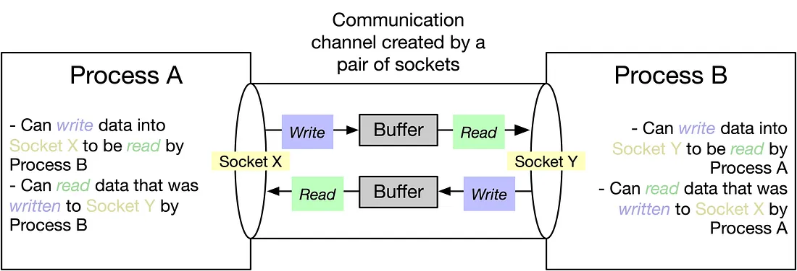
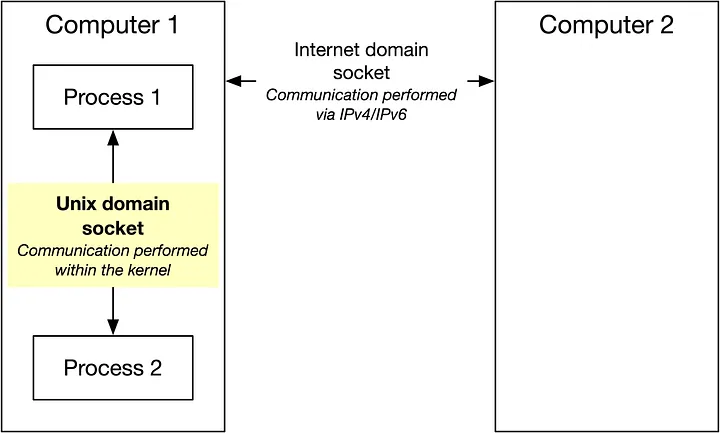
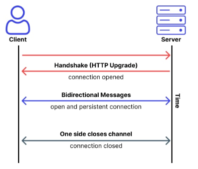
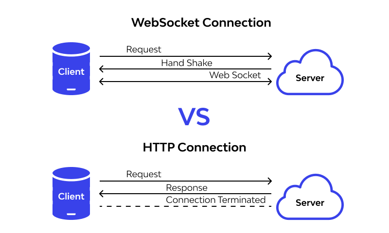

# O Procolo WebSocket

| Identificação | -                                    |
|---------------|--------------------------------------|
| Aluno         | Nicolas Chagas Souza                 |
| Matrícula     | 200042327                            |
| Disciplina    | Fundamentos de Redes de Computadores |
| Turma         | 01                                   |

## Referencial Teórico

### Socket


<fig>Exemplificação de socket entre duas partes comunicantes. (Fonte: Medium [1])</fig>

Um socket fornece um meio de comunicação entre dois processos (Figura 1), ou seja, uma maneira para que eles possam
trocar dados entre si ([1]). Geralmente, a comunicação entre dois processos (`process A` e `process B`), conforme
ilustra a Figura 2, é feita pelo uso dos seus sockets (X e Y, respectivamente).


<fig>(Fonte: Medium [1])</fig>

Existem dois tipos principais de sockets (Figura 3):

- _Unix domain sockets_: permitem a comunicação entre processos em um mesmo computador (IPC).
- _Internet domain sockets_: permitem a comunicação entre processos em uma mesma rede.


<fig>Diferença entre os tipos de socket.(Fonte: Medium [1])</fig>

### WebSocket

O protocolo WebSocket permite uma comunicação bidirecional e _full-duplex_ entre um cliente e um servidor. De acordo com
a especificação (RFC 6455 [2]), o protocolo torna possível a execução de código não confiável, do cliente, em um
ambiente controlado em um servidor, e tem como objetivo fornecer um mecanismo para aplicações baseadas em navegadores se
comunicarem com servidores sem a necessidade de abrir múltiplas conexões HTTP (como o uso de `XMLHttpRequest`
ou `<iframes>`).

O WebSocket foi construído sobre o protocolo TCP, e torna possível a comunicação em tempo real, sendo composto
(Figura 4) por um _handshake_ de abertura, seguido por trocas de mensagens bidirecionais em uma conexão persistente até
que um dos lados finalize a conexão.


<fig>Comunicação cliente servidor via protocolo WebSocket. (Fonte: Wallarm [3])</fig>

### WebSockets vs HTTP

Os WebSockets são ideais para estabelecer a comunicação entre APIs em contextos que exigem troca contínua e/ou rápida de
dados, como aplicações de tempo real, jogos e aplicações de chats.

Entretanto, esse protocolo não deve ser usado quando não há necessidade de troca de dados em tempo real ou de se manter
a a conexão aberta por um longo tempo, sendo o protocolo HTTP mais adequado nesses casos (Figura 5).


<fig>Comparativo entre os protocolos HTTP e WebSocket.(Fonte: Wallarm [3])</fig>

## Prática

A prática desenvolvida visa identificar a diferença de desempenho, metrificados pelo tempo de resposta, na utilização do
protocolo WebSocket, em relação ao HTTP, para múltiplas requisições seguidas, simulando uma conversa entre o cliente e o
servidor, na troca das mensagens: "ping" e "pong".

### Configuração do Ambiente

Compõem o experimento dois processos servidores, um HTTP e um WS (WebSocket), e dois processos clientes, HTTP-Client e
WS-Client. O código-fonte para todos os processos foi escrito em python, com o apoio de um _script_ shell para iniciar e
configurar os serviços.

#### Configuração do Pipenv

```text title="Pipfile"
--8<--
websocket_lab/files/Pipfile
--8<--
```

#### Rodando o Serviço

A configuração do ambiente é feita automaticamente pelo script `start`, desde que o `pipenv` esteja instalado na máquina. Para
rodá-lo basta executar o comando `chmod+x start && ./start` ou `/bin/bash start`, na pasta files.

```shell title="start" linenums="1"

--8<--
websocket_lab/files/start
--8<--

```

### Código-Fonte

O código fonte foi organizado em pacotes python, seguindo a seguinte estrutura:

```text

├── main
│   # Pacote destinado aos clientes.
│   ├── clients 
│   │   ├── __init__.py
│   │   ├── http_client.py
│   │   └── ws_client.py
│   ├── __init__.py
│   ├── __main__.py
│   # Pacote destinado aos servidores.
│   ├── servers
│   │   ├── http_server.py
│   │   ├── __init__.py
│   │   └── ws_server.py
│   # Pacote com funções utilitárias.
│   └── utils
│       └── __init__.py
```

#### Configurações dos Clientes

### Execução

Os argumentos fornecidos para o script são repassados para o módulo main do python, dessa forma, é possível executar os
testes passando as entradas desejadas separadas por espaços. O comando `/bin/bash start 4 80 100 -1` testa os servidores
com 4, 80 e 100 pings, em seguida finaliza os testes.

### Resultados

--8<--
websocket_lab/files/results.md
--8<--

## Considerações Finais

## Referências

[1] <https://medium.com/swlh/getting-started-with-unix-domain-sockets-4472c0db4eb1> <br/>
[2] <https://datatracker.ietf.org/doc/html/rfc6455> <br/>
[3] <https://www.wallarm.com/what/websocket-vs-http-how-are-these-2-different> <br/>

[1] FreeCodeCamp. **An Introduction to HTTP: Understanding the Open Systems Interconnection Model**. Disponível
em: <https://www.freecodecamp.org/news/an-introduction-to-http-understanding-the-open-systems-interconnection-model-9dd06233d30e/>.
Acesso em: 20/11/2023. <br/>
[2] Mozilla Developer Network (MDN). **Client-Server Overview**. Disponível
em: <https://developer.mozilla.org/en-US/docs/Learn/Server-side/First_steps/Client-Server_overview>. Acesso em:
20/11/2023. <br/>
[3] TANENBAUM, Andrew S.; WETHERALL, David J. **Computer Networks**. 5th ed. [Local de Publicação]: Editora, Ano. <br/>

<https://developer.mozilla.org/en-US/docs/Web/API/WebSockets_API>

<https://websockets.spec.whatwg.org/#the-websocket-interface>
