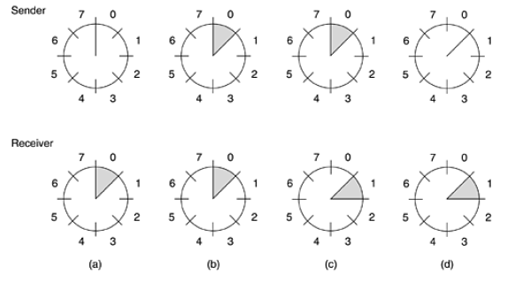
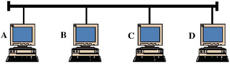

# Lista 1

## Questão 1

Analise as afirmações abaixo e marque a alternativa correta:

I - Ruídos térmicos são fáceis de serem eliminados, mas difíceis de serem tratados uma vez que são normalmente heterogêneos (não
acontecem em igual intensidade em toda a extensão do meio de transmissão)
II - Distância de Hamming é a menor distância que um quadro pode percorrer sem sofrer erros de transmissão
III - Protocolo de comunicação refere-se a um conjunto de regras que rege a comunicação entre entidades pares

a. Apenas a afirmação III está correta
b. Apenas a afirmação II está correta
c. Apenas as afirmações II e III estão corretas
d. Nenhuma das opções está correta
e. Apenas as afirmações I e II estão corretas

## Questão 2

Analise as afirmações abaixo e marque a alternativa correta:

I - A técnica de acesso ao meio no qual há uma divisão de canais em frequências de bandas distribuídas estaticamente é chamado de TDM.

II - Algumas técnicas usam o canal em rajadas, alocando o canal por inteiro a cada estação estaticamente é chamado de FDM

III - No TDM assíncrono cada unidade de informação transmitida deve conter um cabeçalho com os endereços de origem e destino

a. Apenas as afirmações I e III estão corretas
b. Apenas as  afirmações I e II estão corretas
c. Apenas as afirmações II e III estão corretas
d. Apenas a afirmação I está correta
e. Nenhuma das opções está correta

## Questão 3

Analise as afirmações a seguir e marque a opção correta

I - Embora o Modelo de referência OSI/ISO tenha sido concebido como um padrão para comunicação entre sistemas abertos, seu objetivo era mais voltado para comunicação entre sistemas proprietários, em especial os equipamentos do fabricante IBM

II - A arquitetura TCP/IP foi adotada por ser uma solução funcional, completa e confiável, contemplando, desde o início, quando foi criado, todas as demandas e necessidades dos usuários.

III - No modelo OSI, a camada que cuida da gerência de diálogo é a camada de transporte.
a. Apenas as afirmativas I e III estão corretas
b. Nenhuma afirmação está correta
c. Apenas as afirmativas I e II estão corretas
d. Apenas as afirmativas II e III estão corretas
e. Apenas a afirmativa I está correta

## Questão 4

Analise as afirmações e marque a alternativa correta:

I - Um sistema com 1 Mbaud de dados usando codificação Manchester Diferencial é capaz de transmitir dados na ordem de 6 Mbps (baud = número de sinalizações ou pulsos por segundo)

II - Considerando A para sinal Alto (1,0 volt)  e B para sinal baixo (-1,0 volt), a representação Manchester para a sequência de bits 11010 é BABAABBAAB

III -  Sincronismo ao nível de bit é uma necessidade tanto em transmissões síncronas quanto em transmissões assíncronas

a. Todas afirmações estão corretas
b. Apenas as afirmações II e III estão corretas
c. Apenas as afirmações I e III estão corretas
d. Nenhumas das opções está correta
e. Apenas as afirmações I e II estão corretas

## Questão 5

Considerando frequência fundamental (fc) igual a 1,0 MHz e 3 harmônicos (3 senos e 3 cossenos) representando um sinal digital, a a
largura de banda mínima do meio para comportar esse sinal é  é:
a. 8 MHz
b. 10 MHz
c. Nenhuma resposta satisfaz
d. 12 MHz
e. 6 MHz

## Questão 6

Assinale a resposta correta
a. No TDM assíncrono, cada unidade de informação transmitida deve conter um cabeçalho com os endereços de origem e destino
b. Nenhuma das respostas satisfaz
c. A técnica de acesso ao meio no qual há uma divisão de canais em frequências de bandas distribuídas estaticamente é chamado de FDM
d. Na TDM síncrona, os usuários fazem rodízio, um por vez, cada um recebendo a faixa de frequência inteira periodicamente, por um pequeno intervalo de tempo
e. Algumas técnicas usam o canal em rajadas, alocando o canal por inteiro a cada estação por alocação estática é chamado de TDM assíncrono (com slots de tempo fixo)

## Questão 7

Considere um modelo em 3 camadas (n+1) camada superior, (n) camada intermediária e (n-1) camada inferior, sendo (n+1)  e (n-1)
orientadas à conexão e (n) não orientada à conexão. Na comunicação entre duas entidades usando esse modelo, a 10 primitiva é um:
a. Nenhuma das respostas apresentadas é a correta
b. (n+1) connect.indication
c. (n-1) connect.confirm
d. (n) data.request
e. (n-1) data.indication

## Questão 8

Suponha um modem trabalhando na ordem de 900 baud. Esse modem faz modulação combinada de frequência (FSK), fase (PSK) e
amplitude (ASK), com dois níveis de valores em cada uma dessas técnicas. Considerando um canal livre de erros, qual é a máxima taxa
de transmissão em bits por segundo com uso desse modem?
a. 3600 bps
b. Nenhuma alternativa satisfaz
c. 1400 bps
d. 2700 bps
e. 9600 bps

## Questão 9

Uma imagem tem 1024 x 768 pixels, com 4 bits por pixel. Assumindo o transporte não compactado dessa imagem, quanto tempo
(aproximadamente) levaria para transmiti-la num canal de 2KHz, na forma digital a 8 bits por amostra?
a. 15 segundos
b. 30 segundos
c. 96 segundos
d. 60 segundos
e. Nenhuma das respostas satisfaz o enunciado.

## Questão 10

Sabe-se que numa comunicação síncrona os modens usam caracteres de sincronização, caracteres de início e fim de quadro durante
uma transmissão. Por outro lado, modens assíncronos usam bits de sincronismo que são inseridos para cada caractere enviado. Com
base nas considerações (a) e (b) abaixo, descubra qual é o volume mínimo de caracteres necessários para que a transmissão síncrona
seja mais vantajosa (menos overhead) do que a transmissão assíncrona.
a) Na transmissão síncrona, considerar 2 caracteres de sincronização, 1 caractere de início de quadro e 1 caractere de fim de quadro;
b) Na transmissão assíncrona, considerar 1 bit de start e 1 bits de stop por cada caractere enviado.

a. 17 caracteres
b. 22 caracteres
c. 14 caracteres
d. 10 caracteres
e. Nenhuma das alternativas

## Questão 11

Sabe-se que o padrão IEEE802. 11 refere-se a redes locais wireless. Esse tipo de rede também exige alguma técnica de acesso ao meio para evitar colisões entre as estações de trabalho? Se sim, explique (se houver mais de um método, escolha pelo menos um para
explicar; se houver mais de um, apresente pelo menos uma diferença entre eles).

## Questão 12

Analise os relógios representativos para o protocolo de janela deslizante de 1 bit abaixo, com 3 bits p/ numeração dos quadros.

Com base nesse desenho, responda as questões a seguir: ((i) explique o que é janela de transmissão em protocolos de janela
deslizante; ((ii) Se forem alocados dois bits no cabeçalho para numerar os quadros, a janela de transmissão poderia ser igual a 6?
Justifique sua resposta.

## Questão 13

Assinale a alternativa correta
a. Retransmissão seletiva caracteriza-se por fazer um grande uso da rede física, mas em compensação possuir um baixo uso de
buffers no receptor
b. Nenhuma das respostas satisfaz o enunciado.
c. Piggybacking ocorre em transmissão simplex na qual o transmissor envia um reconhecimento ao receptor num quadro de
dados
d. O protocolo stop-and-wait é um caso particular de algoritmo de janela deslizante com janela de transmissão igual a 1
e. O mecanismo de pipelining implementado em protocolos ponto a ponto NÃO produz um aumento na taxa de transmissão de
quadros entre transmissor e receptor, quando comparado ao stop-and-wait

## Questão 14

Assinale as afirmações corretas (verdadeiras)

a. Um sistema com 4 Mbaud de dados usando codificação Manchester Diferencial é capaz de transmitir dados na ordem de 2 Mbps (baud = número de sinalizações ou pulsos por segundo)
b. Ruídos térmicos são fáceis de serem eliminados, mas difíceis de serem tratados uma vez que são normalmente heterogêneos (não acontecem em igual intensidade em toda a extensão do meio de transmissão)
c. Distância de Hamming é a menor distância que um quadro pode percorrer sem sofrer erros de transmissão
d. Considerando A para sinal Alto (1,0 volt)  e B para sinal baixo (-1,0 volt), a representação Manchester Diferencial para a
sequência de bits 11010 é BAABABBAAB
e. Sincronismo ao nível de bit é uma necessidade tanto em transmissões síncronas quanto em transmissões assíncronas

## Questão 15

No caso da rede Token Ring (IEEE 802. 5), o que ocorre quando uma estação de posse da cha é desligada, nos seguintes casos: (a) A
estação desligada é uma estação comum; (b) A estação desligada é a monitora.

a) Nesse caso, a estação-monitora (responsável pelo token na rede) percebe que a cha não está mais circulando e gera nova ficha. b) Nesse caso, as demais estações percebem que não há cha e que também não há estação-monitora. Nesse caso, entra-se em eleição para escolha da estação-monitora, que fará a reposição da cha no meio novamente.

## Questão 16

Dado o quadro 1101011011 e o polinômio gerador 10011, assumindo a inserção de quatro bits de verificação, qual vai ser a nova
sequência a ser transmitida?

a. nenhuma das anteriores
b. 1101011001101
c. 1101011011100
d. 110101101110
e. 0001011001101

## Questão 17

Numa rede IEEE802. 3, existem 4 estações com endereços MAC iguais a A, B, C e D para cada uma delas, conforme demonstra a gura
abaixo.

Um e-mail com 6072 caracteres (considerando 1 caractere = 8bits) originado da estação A direcionado à estação B formará quantos
quadros Ethernet, de quantos bytes cada?

## Questão 18

A sequência abaixo é um fragmento de código binário entregue pela camada de rede à camada de enlace de dados:
000111111011111011101

Após a inserção de bits, segundo a técnica Bit Stung, esse novo padrão caria da seguinte forma (marque a opção correta):

a. 000100011011111011101
b. 0001111101011111011101
c. 11011110011011111011101
d. Nenhuma das respostas é correta
e. 00011111010111110011101

## Questão 19

Suponha um modem trabalhando na ordem de 2400 baud. Esse modem faz modulação por fase (PSK), com utilização de 4 ângulos e,
em cada ângulo, 4 níveis de amplitude (ASK). Considerando um canal livre de erros, qual é a máxima taxa de transmissão em bits por
segundo com uso desse modem?
a. 3600 bps
b. 2800 bps
c. Nenhuma alternativa satisfaz
d. 1400 bps
e. 9600 bps

## Questão 20

“Em uma rede local Ethernet/IEEE802. 3, uma estação só pode absorver o quadro, retirando-o do meio, se perceber que o quadro é
endereçado a ela”. Analise essa frase apontando todas as inconsistências percebidas e reescreva-a de forma correta.

## Questão 21

Sobre o padrão Ethernet responda qual a necessidade de se ter o campo PAD na formação do quadro. O que aconteceria se esse
campo não existisse no cabeçalho do Ethernet?

## Questão 22

Considere um modelo em 3 camadas (n+1), (n) e (n-1), sendo a primeira (n-1) e a terceira(n+1)  orientadas à conexão. Na comunicação entre duas entidades usando esse modelo, a 8ª primitiva é um:

a. É um (n)data request
b. É um (n+1)data.indication
c. É um (n-1)connect.indication
d. É um (n+1) disconnect.indication
e. Nenhuma das respostas

## Questão 23

Uma das diferenças básicas entre switches e hubs 802. 3 é que os switches procuram evitar os chamados “domínios de colisão”. Explique como os switches garantem isso.

### Gabarito

01) Apenas a afirmação III está correta
02) I está errada. A técnica correta seria FDM; II está errada. A técnica correta seria TDM; III está correta. O TDM síncrono (ao contrário do TDM assíncrono) não exige cabeçalho com endereços de origem e destino. A resposta correta é: Nenhuma das opções está correta
03) I - Falso. O Modelo OSI/ISO foi a solução adota para interconexão de sistemas abertos, independente do fabricante e não preso a nenhum fabricante em especial. Serve, portanto, para comunicar sistemas de arquiteturas distintas. II - Falso. O Modelo TCP/IP foi adotado como uma solução eficiente, porém com deficits e funcionalidades que foram sendo acrescidas ao longo do tempo. Portanto, o protocolo nasceu frágil, com  problemas de segurança e  de formação de circuitos virtuais. No entanto, é preciso dizer que muitas melhorias surgiram desde que a primeira versão do TCP/IP foi lançada. III - Falso. Gerência de diálogo, no modelo OSI/ISO, é resolvido na camada de sessão. Nenhuma afirmação está correta.
04) Apenas as afirmações II e III estão corretas
05) Na Série de Fourier e considerando frequência fundamental (fc), 1o harmônico (3fc), 2o. harmônico (5fc), 3o. harmônico (7fc), largura de banda pode ser obtida pela diferença entre a maior frequência (7fc) subtraída da menor frequência (fc), que dá 6fc ou 6 MHz.
06) Algumas técnicas usam o canal em rajadas, alocando o canal por inteiro a cada estação por alocação estática é chamado de TDM assíncrono (com slots de tempo fixo)
07) Nessa configuração, a 10a. primitiva é um (n+1) connect.ind. Resposta: (n+1) connect.indication
08) Com duas amplitudes, duas frequências e duas fases combinadas, o total de possibilidades é 8 e o n=3 (expoente da base 2), que significa que em cada ponto da constelação serão representados 3 bits. Num modem de 900 baud vezes 3bits por baud, o máximo de transmissão é 2700 bps. Resposta: 2700bps
09) Para um canal de 2KHz (2000 ciclos por segundo), o teorema da amostragem aponta que o dobro de amostragens por segundo é suficiente para recuperar o sinal. Portanto, 4000 amostras por segundo e cada amostra comporta 8 bits. Portanto, em 1 segundo passam 32000 bits. Se a imagem tem 1024x768x4bits , o tempo de transmissão é 98 segundos (valor mais próximo). 98 segundos
10) 17 caracteres
11) O padrão IEEE802. 11 utiliza técnicas para evitar colisões (Collision Avoidance). Duas delas são comumente utilizadas, DCF e PCF. O DCF é uma algoritmo MAC que permite a prevenção de colisões através de dois modos de operação: physical channel sensing e virtual channel sensing. A principal diferença entre ambas é a forma como a decisão da transmissão é feita. Para o DCF, a transmissão é descentralizada e feita pelas estações, já o PCF utiliza uma solução centralizada (beacon) para a realização dessa funcionalidade.
12) Resposta: (i) Janela de transmissão refere-se ao número máximo de quadros passíveis de serem enviados sem aguardar confirmação do destinatário; (ii) O tamanho da janela de transmissão é impactado diretamente pelo número de bits p alocar os quadros. Por exemplo, para 2 bits, o maior valor de um quadro é 3 e as janelas não poderiam ser superiores a esse valor.
13) O protocolo stop-and-wait é um caso particular de algoritmo de janela deslizante com janela de transmissão igual a 1
14) Todas.
15) Sobre os casos citados no Token Ring:
16) nenhuma das anteriores.
17) Para 6072 bytes, serão necessários 5 quadros da seguinte forma: Q0 - 18bytes  de cabeçalho + 1500bytes e PAD=0; Q1 - 18bytes  de cabeçalho + 1500bytes e PAD=0; Q2 - 18bytes  de cabeçalho + 1500bytes e PAD=0; Q3 - 18bytes  de cabeçalho + 1500bytes e PAD=0; Q4 - 18bytes  de cabeçalho + 72bytes e PAD=0;
18) E
19) 9600 bps
20) Em qualquer das situações, uma estação de trabalho não é capaz de impedir que o quadro continue fluindo e chegando às demais estações (característica de meios broadcast).Uma estação de trabalho pode copiar a mensagem que passa no meio sob três condições:((i) o endereço de destino é unicast e faz referência direta ao MAC Address da referida estação de trabalho; ((ii) o endereço de destino é multicast e a estação de trabalho faz parte do grupo de multicast referenciado; (i(ii) o endereço de destino é broadcast.
21) O campo PAD é para garantir pelo menos 46 bytes no campo payload do quadro. Se esse campo não existisse, haveria dificuldade de se perceber colisões ao longo do segmento de rede IEEE/802. 3.
22) E. A resposta correta é (n-1) data.ind.
